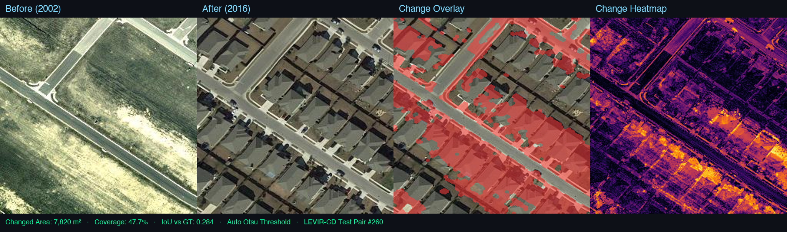

<h1 align="center">AeroMap Change Intelligence</h1>

<p align="center">
  <b>Aerial Bi-Temporal Change Detection · LEVIR-CD · Zero-Shot Inference</b><br/>
  Detect what changed between two aerial images — no model training required.
</p>

<p align="center">
  
  
  
  
  
</p>

---



> *LEVIR-CD Test Pair #260 — Vacant land (2002) → Dense residential estate (2016) · 7,820 m² of detected structural change*

---

## What it does

Upload two aerial images of the same location taken at different times. The pipeline computes pixel-level change, thresholds it automatically using Otsu's method, cleans up noise with morphological filters, and renders:

- **Change Overlay** — red mask over changed regions on the "After" image
- **Change Heatmap** — inferno-coloured intensity map of the raw diff signal
- **Metrics** — changed area in m², site coverage %, and IoU vs ground truth (when using LEVIR-CD)

No model training. No GPU required. Runs on CPU/MPS in seconds.

---

## How it works

```
Image A (Before) ──┐
                   ├──► Per-channel Abs Diff ──► Mean across RGB ──► Otsu Threshold
Image B (After)  ──┘                                                       │
                                                                            ▼
                                               Morphological CLOSE + OPEN (5×5 ellipse)
                                                                            │
                                              ┌─────────────────────────────┤
                                              ▼                             ▼
                                      Change Overlay              Inferno Heatmap
```

| Step | Detail |
|------|--------|
| Pixel diff | `|A - B|` averaged across R, G, B channels |
| Otsu threshold | Automatically finds the natural split between changed / unchanged pixels — no manual tuning |
| Morphological close | Fills small holes inside detected buildings |
| Morphological open | Removes isolated noise specks (shadows, tree canopy flicker) |
| Area estimation | `changed_pixels × GSD²` — configurable ground sampling distance |

---

## Dataset — LEVIR-CD

[LEVIR-CD](https://justchenhao.github.io/LEVIR/) is a large-scale building change detection dataset: 637 bi-temporal high-resolution Google Earth image pairs (0.5 m/pixel GSD) collected between 2002 and 2018. The HuggingFace version used here (`ericyu/LEVIRCD_Cropped_256`) contains **2048 pre-cropped 256×256 test pairs** with pixel-level ground truth masks.

---

## Quick Start

```bash
# 1. Clone
git clone https://github.com/aryabhardwaj23/AeroMap-ChangeDetector.git
cd AeroMap-ChangeDetector

# 2. Create venv and install
python3 -m venv venv
source venv/bin/activate
pip install streamlit pillow opencv-python-headless pyarrow torch torchvision

# 3. (Optional) Download LEVIR-CD test set — ~150 MB
python3 -c "
from huggingface_hub import snapshot_download
snapshot_download('ericyu/LEVIRCD_Cropped_256', repo_type='dataset')
"

# 4. Run
streamlit run app.py
```

Open **http://localhost:8501** in your browser.

---

## Usage

### Mode 1 — LEVIR-CD test set
Select any of the 2048 test pairs with the slider. Pair **#260** (vacant land → full residential estate) and **#1700** (34.3% coverage) are the most visually dramatic.

### Mode 2 — Upload your own pair
Upload two aerial images of the **same location** at different times (Google Earth historical imagery works well). The pipeline normalises size automatically.

---

## Sample Results

| Pair | Scene | Coverage | Changed Area |
|------|-------|----------|-------------|
| #260 | Vacant land → residential estate | 47.7% | 7,820 m² |
| Industrial (upload) | Open land → warehouses | 26.3% | 22,340 m² |

---

## Project Structure

```
AeroMap-ChangeDetector/
├── app.py          # Streamlit dashboard
├── detect.py       # Core pipeline: predict(), overlay(), heatmap_rgb()
├── assets/
│   └── demo.png    # 4-panel demo composite
└── samples/        # 20 local LEVIR-CD sample pairs (A / B / L)
```

---

## Tech Stack

| Library | Role |
|---------|------|
| OpenCV | Otsu threshold, morphological ops, colourmap |
| Pillow | Image I/O and overlay compositing |
| PyArrow | Reading LEVIR-CD HuggingFace parquet without pandas |
| Streamlit | Interactive dashboard |
| PyTorch | MPS/CPU device detection (no model weights needed) |

---

## Related Projects

- [AeroMap-Edge](https://github.com/aryabhardwaj23/AeroMap-Edge) — Real-time drone inspection: YOLO11n detection + Depth Anything V2 metric depth + ORB visual odometry

---

<p align="center">Built for drone-company portfolios · Tested on Apple M3 · No GPU required</p>
